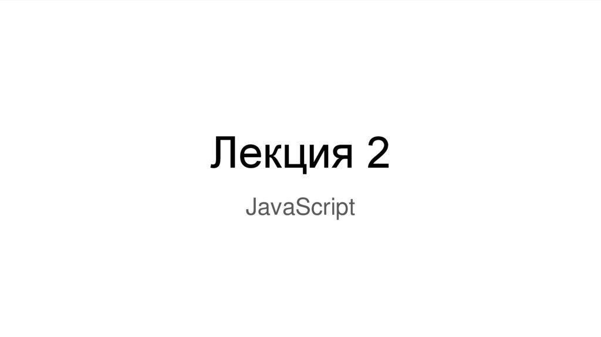
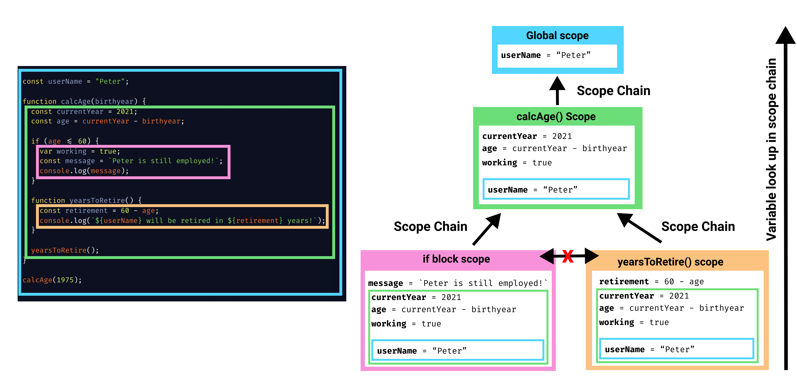
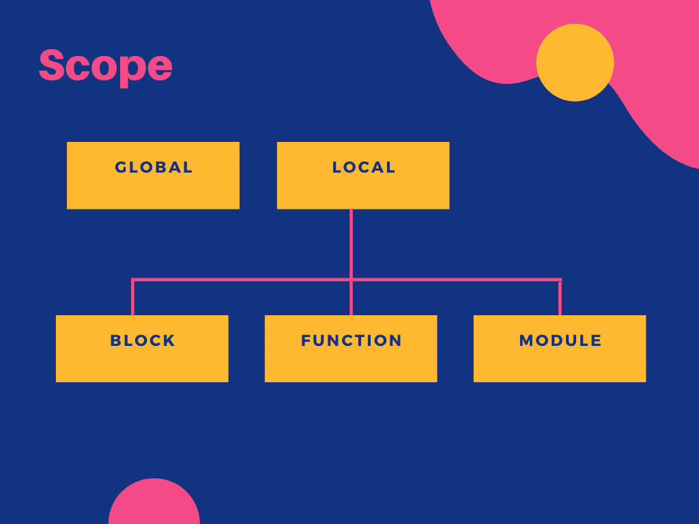
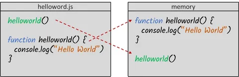
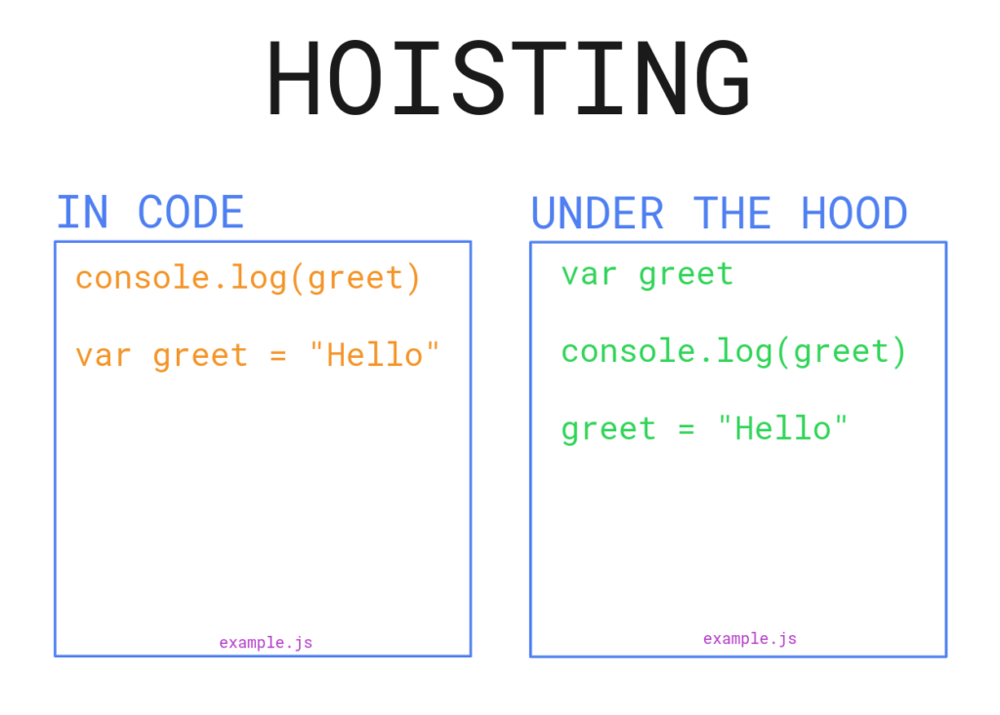
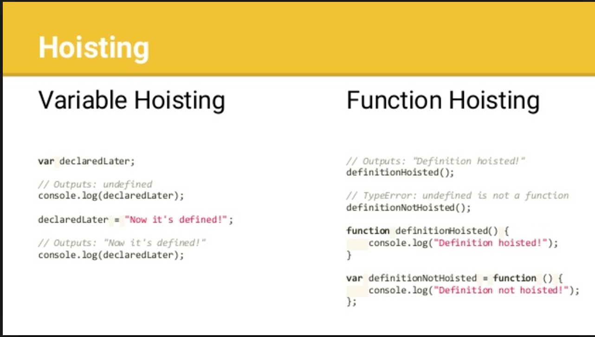
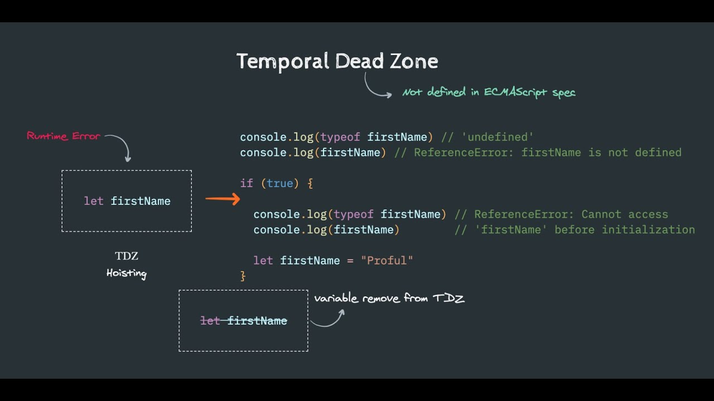

## Lecture 2 Javascript

## What is scope in Javascript?
### Область видимости в JavaScript относится к доступности или видимости переменных и выражений. Это означает пространство, в котором элемент, такой как переменная или функция, виден и доступен в вашем коде.
### Например, как только переменная объявлена, она может быть доступна только в той области, в которой она была объявлена, и не будет доступна за пределами области.

## How many scope in Javascript?
### Четыре области:
### Глобальный - виден всем
### Функция - видимая внутри функции (и ее подфункций и блоков)
### Блок - видимый внутри блока (и его подблоков)
### Модуль - виден внутри модуля

## Three types of scope
 

## What is hoisting?

### Hoisting - это механизм JavaScript, в котором объявления переменных и функций перемещаются в верхнюю часть их области видимости перед выполнением кода.
### Неизбежно это означает, что независимо от того, где объявлены функции и переменные, они перемещаются в верхнюю часть своей области независимо от того, является ли их область глобальной или локальной.
### Однако следует отметить тот факт, что механизм подъема перемещает только объявление. Назначения остаются на месте.

## Hoisting in Javascript

## Hoisting variable var and function declaration
### Function Declaration - это механизм JavaScript, при котором объявления функций перемещаются в верхнюю часть их области видимости перед выполнением кода.

## TDZ (Temporal Dead Zone)
### Временная мертвая зона (TDZ) - это концепция в JavaScript, которая при неправильном понимании может привести к неожиданному поведению. TDZ - это период времени между созданием переменной и моментом, когда она инициализируется значением. В течение этого времени любая попытка доступа к переменной приведет к ошибке ссылки.
